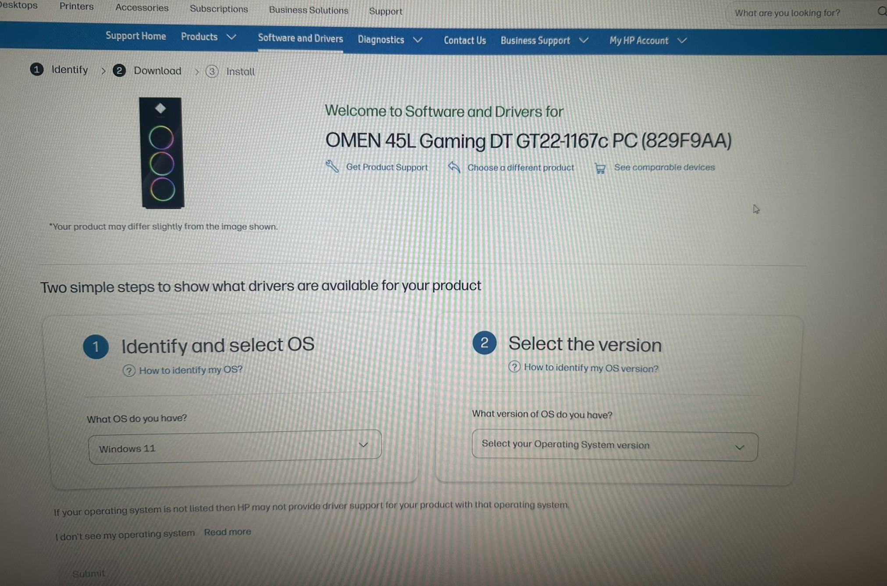
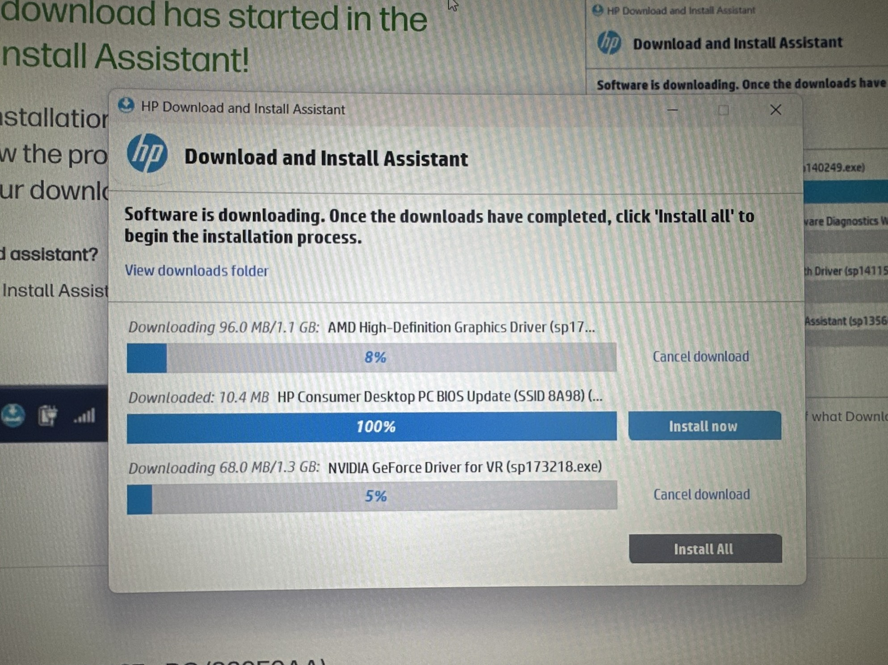
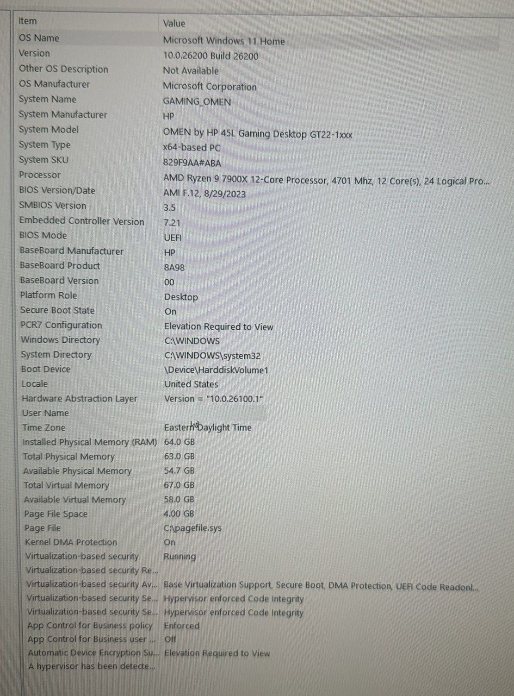
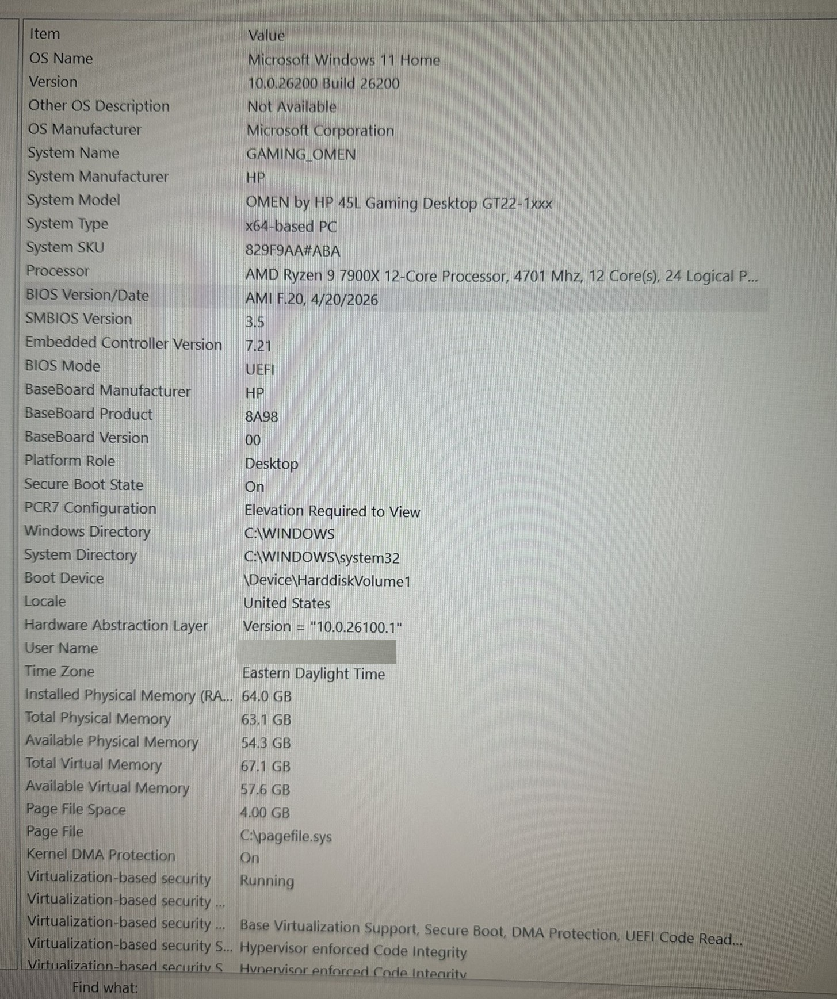
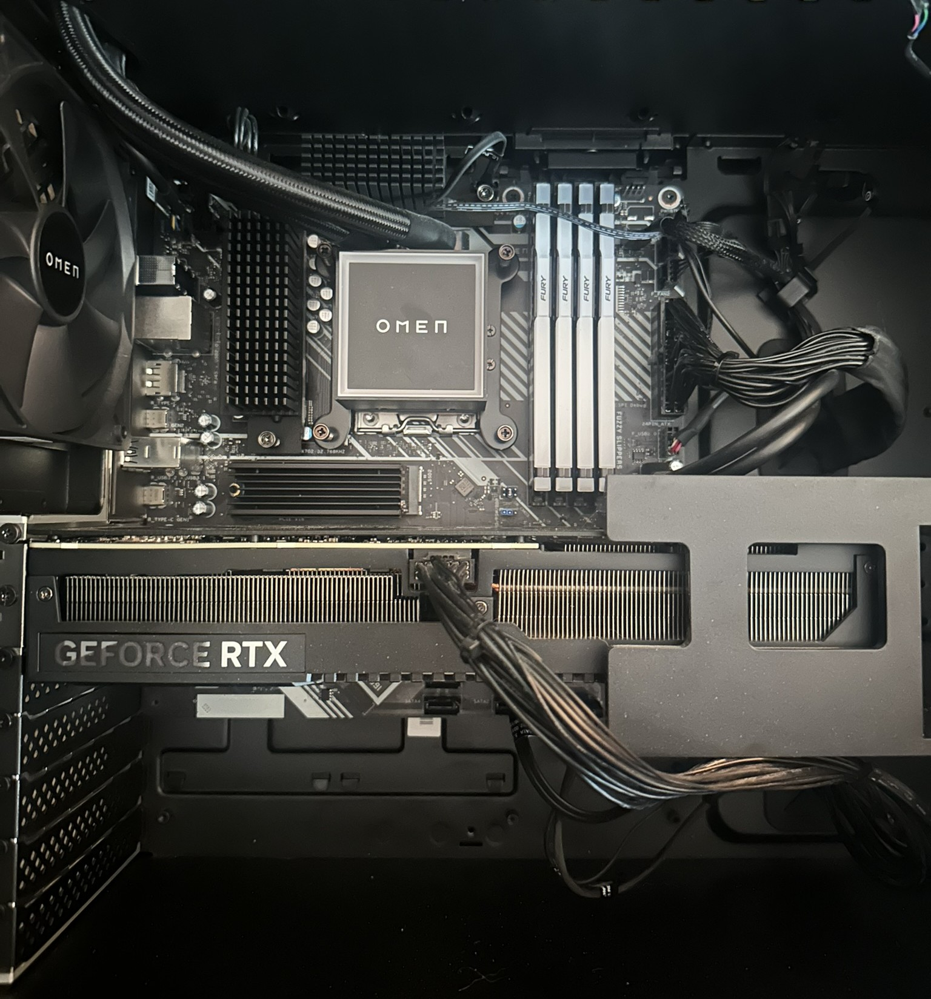
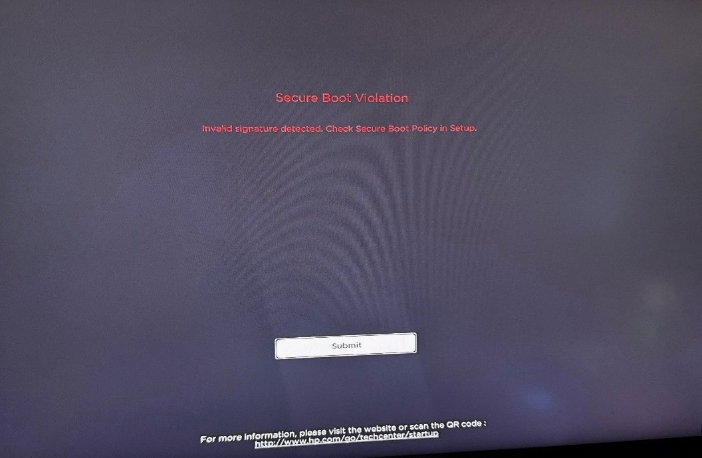
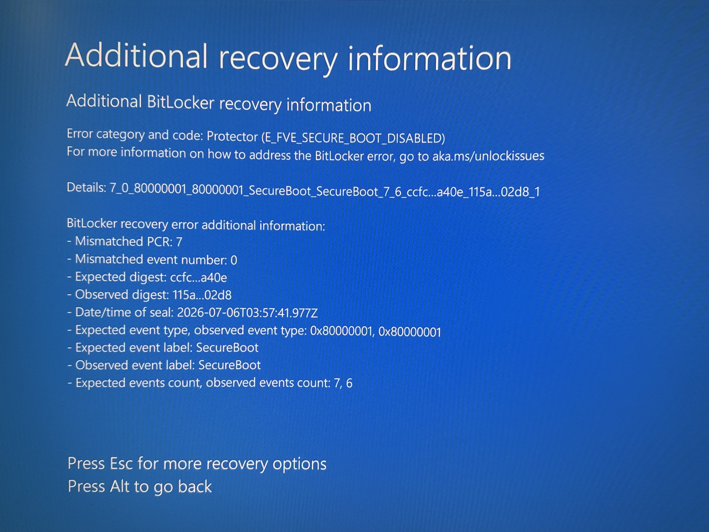
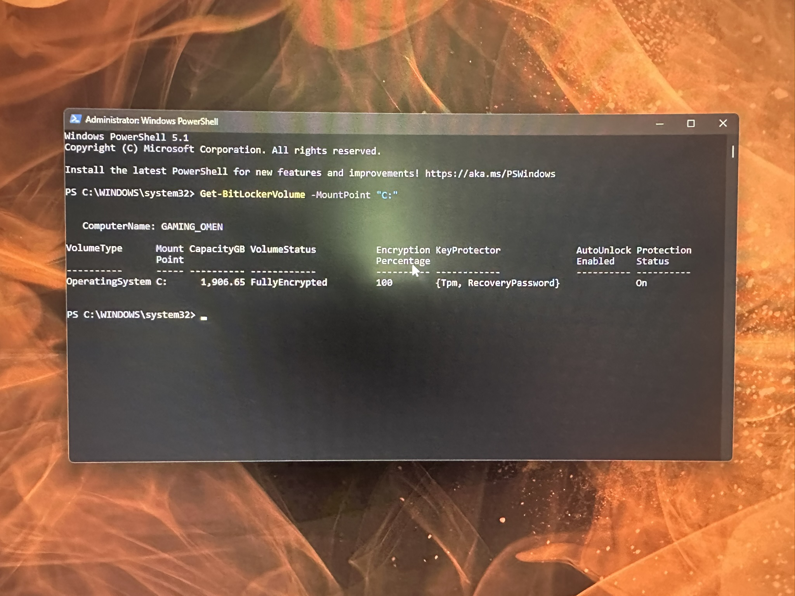
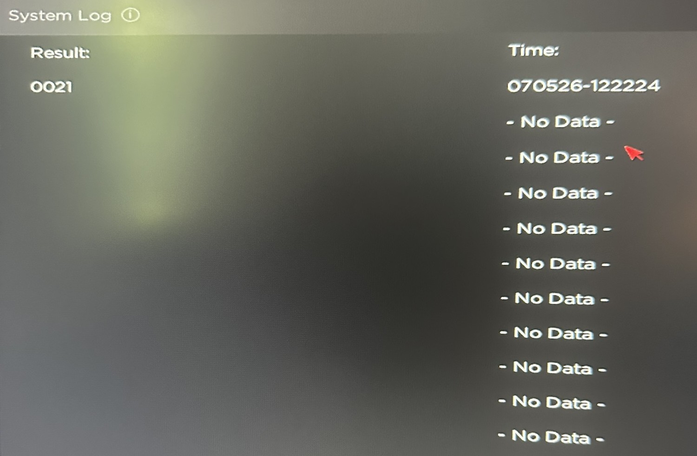

## 🔐 HP Omen Secure Boot & BitLocker Recovery

### Windows UEFI / TPM Troubleshooting & Root Cause Analysis


---

## 🧠 Scenario

A normally functioning **HP Omen 45L** running Windows 11 suddenly failed to boot following what appeared to be a routine background firmware/OS update.

The first failure presented as a **Secure Boot violation**, reporting that a boot component had an invalid signature.

On the following boot attempt, the system instead presented a **BitLocker Recovery** screen requesting the 48-digit recovery key.

At first, the symptoms appeared to point toward a potentially serious hardware or firmware problem. After recovering access, however, a second issue complicated the diagnosis: the system began intermittently entering a **POST loop when a Bluetooth headset USB dongle was connected during startup**.

The troubleshooting process therefore became two related but ultimately separate problems:

1. **Secure Boot / TPM / BitLocker failure following an update**
2. **USB peripheral causing a secondary POST enumeration problem**

Rather than immediately replacing hardware or assuming a failing CMOS battery, the system was ultimately diagnosed through **UEFI configuration, BitLocker recovery tools, PowerShell, and Windows Event Viewer**.

The investigation demonstrated that the original BitLocker lockout was a security response to changed boot measurements — not evidence of a failed TPM, motherboard, or storage device.

---

## 🔥 Triggering Event

The BIOS update was located and downloaded through HP's own Software and Drivers portal.

<a href="images/IMG_5852.JPEG"></a>

*HP's Software and Drivers page for the OMEN 45L Gaming DT GT22-1167c PC.*

<a href="images/IMG_5853.JPEG"></a>

*HP Download and Install Assistant downloading an HP Consumer Desktop PC BIOS Update (SSID 8A98), alongside AMD and NVIDIA driver updates.*

A system information comparison before and after confirms the update actually changed the platform's firmware version:

<table>
<tr>
<td align="center" width="50%">
<a href="images/IMG_5691.JPEG"></a>
<br><em>Before — BIOS F.12, 8/29/2023</em>
</td>
<td align="center" width="50%">
<a href="images/IMG_5855.JPEG"></a>
<br><em>After — BIOS F.20, 4/20/2026</em>
</td>
</tr>
</table>

This is the concrete triggering event referenced throughout the rest of this write-up: not a hypothetical "a firmware update happened," but a documented, dated BIOS version change immediately preceding the failure.

---

## 🎯 Objective

The objectives of this recovery were to:

* Restore normal Windows boot functionality
* Recover access to a BitLocker-protected Windows installation
* Determine why Secure Boot rejected the boot environment
* Identify the cause of the BitLocker recovery event
* Restore the system to a secure UEFI/Secure Boot configuration
* Verify that BitLocker remained properly configured
* Investigate the secondary POST loop
* Determine whether the POST behavior represented a hardware failure
* Identify the actual root cause using available system evidence
* Document preventative measures for future firmware/BIOS updates

---

## 🖥️ Environment

| Component                    | Configuration                                                       |
| ---------------------------- | ------------------------------------------------------------------- |
| **System**                   | HP Omen 45L                                                         |
| **Operating System**         | Windows 11                                                          |
| **Firmware Interface**       | UEFI                                                                |
| **Secure Boot**              | Enabled                                                             |
| **TPM**                      | TPM 2.0                                                             |
| **Disk Encryption**          | BitLocker                                                           |
| **Boot Mode**                | UEFI                                                                |
| **Problem Peripheral**       | Bluetooth headset USB dongle                                        |
| **Primary Diagnostic Tools** | UEFI/BIOS, BitLocker Recovery Environment, PowerShell, Event Viewer |

### 📷 Physical System

<a href="images/IMG_5689.JPEG"></a>

*Internal view of the HP Omen 45L during the troubleshooting process.*

---

## 🚨 Initial Symptoms

The system exhibited several distinct symptoms during the recovery process.

### 1. Secure Boot Violation

The initial boot attempt produced a UEFI Secure Boot violation indicating that a boot component had an **invalid signature**.

<a href="images/Picture1.jpg"></a>

*Secure Boot Violation — "Invalid signature detected. Check Secure Boot Policy in Setup."*

This immediately suggested that the firmware no longer trusted something in the Windows boot chain.

At this stage, there was no reason to assume that the operating system itself was damaged. Secure Boot was doing exactly what it was designed to do: refusing to execute a boot component whose signature no longer matched the expected trust configuration.

---

### 2. BitLocker Recovery Prompt

A subsequent boot attempt reached the BitLocker recovery screen and requested the system's **48-digit recovery key**.

The recovery key was not immediately available.

The recovery screen also provided additional diagnostic information that became important later in the investigation.

<a href="images/IMG_5686.JPEG"></a>

*BitLocker Recovery — Additional recovery information showing `E_FVE_SECURE_BOOT_DISABLED` and a PCR 7 mismatch.*

The screen reported:

```text
Error category and code: Protector (E_FVE_SECURE_BOOT_DISABLED)

Mismatched PCR: 7
Mismatched event number: 0
Expected digest: ccfc...a40e
Observed digest: 115a...02d8
Expected event type: 0x80000001
Observed event type: 0x80000001
Expected event label: SecureBoot
Observed event label: SecureBoot
Expected events count: 7
Observed events count: 6
```

It also recorded the seal time:

```text
2026-07-06T03:57:41.977Z
```

The most significant information was the **PCR 7 mismatch associated with SecureBoot**. PCR 7 is used by the TPM to record measurements associated with Secure Boot policy and configuration. This provided direct evidence that the BitLocker recovery event was related to a change in the measured Secure Boot state, and the seal time became useful later when correlating this event with the subsequent Windows and TPM events.

This created a second barrier to recovery because even if the Secure Boot issue could be bypassed, BitLocker was now protecting access to the Windows volume.

---

### 3. Secondary POST Loop

After the initial recovery, the system developed another intermittent problem.

When the Bluetooth headset's USB dongle was connected during startup, the system could sometimes fail to progress normally through POST.

The system would repeatedly attempt to start rather than handing control over to Windows.

Because the system had already experienced a firmware-related boot problem, this initially raised the possibility of a motherboard, CMOS, or firmware problem.

That hypothesis ultimately proved incorrect.

---

## 🔎 Initial Hypothesis

The POST-loop behavior initially appeared consistent with a possible **failing CMOS battery** or another firmware-level hardware problem.

A system repeatedly failing during startup can make a CMOS or motherboard problem seem like a reasonable first hypothesis. On this particular system, replacing the CMOS battery would also have required removing the graphics card mount to access it — a genuinely tedious job worth avoiding if the evidence didn't actually support it.

However, the symptoms did not provide enough evidence to justify replacing hardware.

The diagnostic approach was therefore:

> **Preserve the initial hypothesis, but test it against evidence before taking hardware action.**

This became especially important once the BitLocker and Secure Boot events could be correlated with the timing of the update.

---

## 🩺 Ruling Out File Corruption

As an early diagnostic step, a system file integrity check was run to rule out corrupted Windows files as a contributing cause:

```text
sfc /scannow
```

The scan completed with no integrity violations found.

This result narrowed the field of possible causes before the Event Viewer investigation identified the actual TPM/Secure Boot mechanism below — a corrupted system file was ruled out early rather than assumed absent.

Notably, when this issue was described to a colleague with three years of professional IT support experience, she noted she had never personally encountered this specific failure pattern — reinforcing that this was a genuinely unusual scenario rather than a routine, well-documented fix.

---

# 🛠️ Investigation & Recovery

## 🔓 Step 1 — Bypass Secure Boot

The first objective was simply to regain a boot path into the operating system.

The system's UEFI configuration was accessed and **Secure Boot was temporarily disabled**.

This allowed the system to move past the Secure Boot signature validation failure.

The goal was not to leave Secure Boot disabled permanently.

Instead, this was treated as a temporary recovery step so the underlying BitLocker and Windows state could be investigated.

---

## 🔐 Step 2 — Recover BitLocker Access

The next obstacle was the BitLocker recovery screen.

The Windows Recovery Environment was accessed through:

**Advanced Options → Command Prompt**

The following command was used:

```powershell
manage-bde -protectors -disable c:
```

This temporarily suspended the BitLocker protector associated with the operating system volume, allowing the system to proceed through recovery rather than immediately requiring the unavailable recovery key.

The BitLocker recovery key was ultimately retrieved through the Microsoft account associated with the system using a separate device.

Once the key and system access were restored, investigation could continue from within Windows.

---

# 🔧 Step 3 — Restore the Security Baseline

Once Windows access was recovered, the objective changed from **bypass** to **restoration**.

Secure Boot should not remain disabled on a normal Windows 11 installation.

The system was returned to the UEFI configuration and the Secure Boot keys/configuration were restored using the available HP Omen firmware options:

**Secure Boot Configuration → Restore Factory Keys / Setup Defaults**

The system was also verified to be operating in UEFI mode.

Legacy Support remained disabled.

Secure Boot was then re-enabled.

The intended security configuration was therefore restored:

```text
UEFI
  │
  ├── Secure Boot = Enabled
  │
  ├── TPM 2.0 = Enabled
  │
  └── Windows Boot Manager
          │
          └── BitLocker-protected Windows volume
```

---

## 💽 Step 4 — Verify BitLocker

After restoring the firmware security configuration, BitLocker status was checked from Windows.

```powershell
Get-BitLockerVolume -MountPoint "C:"
```

<a href="images/IMG_5690.JPEG"></a>

*`Get-BitLockerVolume` output confirming the volume is FullyEncrypted with Tpm and RecoveryPassword key protectors, and Protection Status: On.*

The resulting state confirmed that the Windows volume was:

```text
VolumeStatus: FullyEncrypted
```

The BitLocker configuration was then verified and re-armed as necessary.

The documented configuration command was:

```powershell
Enable-BitLocker -MountPoint "C:" -EncryptionMethod XtsAes128 -UsedSpaceOnly
```

The important objective was not simply getting Windows to boot.

The objective was to ensure that the system returned to a properly encrypted and trusted state after recovery.

---

# 🔍 Step 5 — Investigate the Actual Cause

At this point, the system was operational again.

However, simply restoring functionality does not answer the most important troubleshooting question:

> **Why did this happen in the first place?**

Rather than assuming the TPM or motherboard had failed, Windows Event Viewer was used to investigate the BitLocker events surrounding the failure.

The relevant log was:

```text
Applications and Services Logs
└── Microsoft
    └── Windows
        └── BitLocker-API Management
```

Three events were particularly important.

---

### 📌 Event 898 — TPM Measurement Mismatch

Event 898 reported that the TPM detected a mismatch between its stored security measurements and the measurements produced by the current boot configuration.

In practical terms, the TPM was seeing a boot environment that was different from the one associated with the previously trusted state.

This aligned with the Secure Boot violation.

The evidence suggested that the boot environment had changed rather than that the TPM itself had failed.

---

### 📌 Event 4103 — TPM Key Request Denied

Event 4103 showed that Windows made a silent TPM request for the BitLocker encryption key, but the request was denied.

Because the TPM could not validate the current boot measurements against the trusted state, it refused to release the encryption key automatically.

That explains why BitLocker transitioned into recovery mode.

The recovery screen was therefore not a separate unexplained failure.

It was the expected security response to the TPM refusing to trust the altered boot state.

---

### 📌 Event 793 — TPM Resealed Successfully

Event 793 later showed that BitLocker successfully resealed the volume to the TPM using the new boot measurements.

This was a critical confirmation.

It demonstrated that the TPM could successfully establish a new trusted state after the boot configuration had been restored.

The event sequence therefore provided a coherent timeline:

```text
Firmware / Windows Update
        │
        ▼
Boot configuration changes
        │
        ▼
Secure Boot detects signature mismatch
        │
        ▼
TPM measurements no longer match
        │
        ▼
TPM refuses BitLocker key request
        │
        ▼
BitLocker Recovery
        │
        ▼
Boot configuration restored
        │
        ▼
TPM reseals using new measurements
        │
        ▼
Normal trusted boot restored
```

---

# 🧩 Root Cause Analysis

The evidence supported a much different conclusion from the initial hardware-failure hypothesis.

The most likely sequence was:

1. A Windows/HP firmware update modified elements of the boot environment.
2. Secure Boot detected that the resulting boot component signature no longer matched the expected trusted state.
3. The TPM detected that the platform's boot measurements had changed.
4. Specifically, **PCR 7 no longer matched the value recorded when BitLocker was sealed.**
5. The TPM therefore refused the automatic BitLocker key request.
6. BitLocker correctly entered recovery mode as a security fail-safe.
7. Once the configuration was restored and recovery completed, BitLocker successfully resealed itself against the new trusted measurements.

There was also a complicating factor during the same general recovery period involving a **display signal/reconfiguration issue**.

The display disruption appears to have contributed to the recovery process by obscuring an OMEN firmware passcode-confirmation prompt associated with the Secure Boot configuration change.

This made the overall failure appear more confusing than the underlying TPM/Secure Boot sequence actually was.

### The important distinction

The evidence did **not** indicate:

```text
Failed TPM
Failed SSD
Failed motherboard
Corrupted Windows installation
Dead CMOS battery
```

Instead, the evidence supported:

```text
Boot configuration change
        ↓
Secure Boot trust mismatch
        ↓
PCR 7 measurement mismatch
        ↓
TPM refuses BitLocker key release
        ↓
BitLocker Recovery
```

This distinction was important because replacing hardware would not have addressed the actual problem.

---

# 🔌 Step 6 — Investigate the USB POST Loop

With the BitLocker/Secure Boot issue resolved, a separate startup problem remained.

The system could intermittently enter a POST loop when the Bluetooth headset's USB dongle was connected during startup.

The first question was whether the system was simply trying to boot from the USB device.

That possibility was investigated by checking the boot order.

The internal Windows Boot Manager was already prioritized ahead of USB devices.

Therefore, simple boot-priority misconfiguration did not adequately explain the behavior.

---

## 🔬 USB Enumeration Hypothesis

The investigation instead focused on **USB device enumeration during POST**.

The OMEN firmware was attempting to initialize connected USB hardware before transferring control to Windows.

The behavior suggested that the headset's USB dongle could cause the firmware to hang while enumerating the device.

This explained why:

* The system could boot normally without the dongle.
* The problem occurred before Windows fully loaded.
* Changing the normal boot order did not resolve it.
* The same peripheral could be connected successfully after Windows had already started.

The available OMEN firmware did not expose a traditional:

```text
USB Legacy Support
```

option.

Instead, the relevant firmware setting was:

```text
Advanced Boot
└── Options
    └── USB Boot
```

USB Boot was disabled.

---

### 📷 OMEN Firmware Evidence

<a href="images/IMG_5687.JPEG"></a>

*OMEN Setup Utility system log showing firmware-level startup information, reviewed during the POST-loop investigation.*

This provided additional evidence that the troubleshooting process was occurring at the firmware/POST layer rather than solely within Windows.

---

## ✅ Step 7 — Verify the USB Fix

The peripheral behavior was then tested independently.

The system was allowed to boot normally and the USB devices were reintroduced individually.

The problematic Bluetooth headset dongle could be connected after Windows had loaded without reproducing the POST failure.

This confirmed that the problem was associated with **early USB initialization/enumeration during POST**, rather than a general inability of Windows or the USB hardware to function.

The secondary problem was therefore treated separately from the original BitLocker/Secure Boot incident.

---

# 🔄 Recovery Verification

The system was considered recovered only after verifying both the security configuration and the hardware behavior.

### Security verification

* Secure Boot was re-enabled.
* UEFI boot mode was confirmed.
* TPM functionality was operating normally.
* BitLocker reported the Windows volume as fully encrypted.
* BitLocker successfully resealed to the TPM's current measurements.
* Windows booted normally.

### Hardware/POST verification

* System completed POST normally without the problematic USB device interfering.
* Internal Windows Boot Manager remained the intended boot target.
* USB Boot was disabled in the OMEN firmware.
* The Bluetooth headset could be connected after Windows startup.
* The POST-loop behavior was no longer reproduced under normal use.

---

# 🔁 Recurrence — Second Occurrence

Approximately two weeks after the initial recovery, the same failure pattern occurred again following another firmware/OS update: a Secure Boot violation followed by a BitLocker recovery prompt.

This recurrence was treated as an opportunity to test the root-cause model established during the first incident rather than as a new, unexplained problem. The same diagnostic steps — restoring Secure Boot configuration, checking BitLocker status, and reviewing the BitLocker-API Management log for the same 898 → 4103 → 793 event sequence — were applied, and the system resolved along the same path as before.

This second occurrence reinforced the original root-cause conclusion: rather than pointing to a new or different failure, it confirmed that **any future firmware/BIOS update on this system has the potential to re-trigger the same TPM/Secure Boot measurement mismatch**, unless BitLocker is proactively suspended beforehand — exactly as identified in Lesson #1 below.

---

# 🧠 Troubleshooting Flow

```text
┌──────────────────────────────┐
│ Windows / Firmware Update    │
└──────────────┬───────────────┘
               │
               ▼
┌──────────────────────────────┐
│ Secure Boot Violation        │
│ Invalid Boot Signature       │
└──────────────┬───────────────┘
               │
               ▼
┌──────────────────────────────┐
│ PCR 7 Measurement Mismatch   │
│ SecureBoot Measurement       │
└──────────────┬───────────────┘
               │
               ▼
┌──────────────────────────────┐
│ BitLocker Recovery           │
│ TPM refuses automatic key    │
└──────────────┬───────────────┘
               │
               ▼
┌──────────────────────────────┐
│ Recovery Environment         │
│ BitLocker Protector Disabled │
└──────────────┬───────────────┘
               │
               ▼
┌──────────────────────────────┐
│ Recovery Key Retrieved       │
│ Windows Access Restored      │
└──────────────┬───────────────┘
               │
               ▼
┌──────────────────────────────┐
│ Restore Secure Boot Keys     │
│ UEFI + Secure Boot Enabled   │
└──────────────┬───────────────┘
               │
               ▼
┌──────────────────────────────┐
│ Event Viewer Investigation   │
│ 898 → 4103 → 793             │
└──────────────┬───────────────┘
               │
               ▼
┌──────────────────────────────┐
│ TPM Reseal Confirmed         │
│ Trusted Boot Restored        │
└──────────────┬───────────────┘
               │
               ▼
┌──────────────────────────────┐
│ Secondary USB POST Loop      │
└──────────────┬───────────────┘
               │
               ▼
┌──────────────────────────────┐
│ USB Enumeration Investigation│
└──────────────┬───────────────┘
               │
               ▼
┌──────────────────────────────┐
│ Disable USB Boot             │
│ Verify Normal POST           │
└──────────────────────────────┘
```

---

# 🛡️ Lessons Learned

## 1. Suspend BitLocker Before Firmware Changes

Before performing BIOS or firmware updates, BitLocker should be temporarily suspended.

A documented approach is:

```powershell
Suspend-BitLocker -MountPoint "C:" -RebootCount 1
```

This prevents a predictable firmware change from unexpectedly triggering BitLocker recovery.

---

## 2. Maintain Multiple Copies of the Recovery Key

A BitLocker recovery key should not exist in only one location.

A Microsoft account can provide convenient recovery access, but having another secure copy — such as a printed copy or appropriately protected removable storage — provides redundancy when the primary device or account cannot immediately be accessed.

---

## 3. Don't Assume a Boot Loop Means Hardware Failure

A boot loop can be caused by:

* Firmware configuration
* Secure Boot
* Boot-device enumeration
* USB initialization
* TPM state
* Bootloader problems
* Hardware

The symptom alone does not identify the cause.

In this case, the initial CMOS hypothesis was reasonable, but the available evidence eventually pointed elsewhere.

---

## 4. Use Event Viewer Before Replacing Hardware

The BitLocker-API Management events provided the evidence needed to distinguish a **security-state mismatch** from a hardware failure.

The sequence:

```text
Event 898
    ↓
TPM measurement mismatch

Event 4103
    ↓
TPM key request denied

Event 793
    ↓
TPM resealed successfully
```

provided a much stronger diagnosis than simply observing that the system could not boot.

---

## 5. Understand What Secure Boot and BitLocker Are Actually Doing

The two technologies are closely related but serve different purposes.

```text
Secure Boot
    ↓
Validates trusted boot components

TPM
    ↓
Measures and validates platform state

BitLocker
    ↓
Uses TPM trust to protect encryption keys
```

A Secure Boot failure can therefore lead indirectly to a BitLocker recovery event when the TPM's measurements no longer match the previously trusted boot configuration.

---

## 6. Modern UEFI Systems May Handle USB Boot Differently

The OMEN firmware did not expose a traditional "USB Legacy Support" setting.

Instead, the relevant control was:

```text
Advanced Boot
└── Options
    └── USB Boot
```

Understanding the terminology and options exposed by a specific OEM firmware implementation is important when troubleshooting POST behavior.

---

# 💻 Commands & Tools

## System File Integrity Check

Ruled out corrupted system files as an early diagnostic step:

```text
sfc /scannow
```

Result: no integrity violations found.

---

## BitLocker Recovery Environment

Temporarily disable BitLocker protectors:

```powershell
manage-bde -protectors -disable c:
```

---

## PowerShell — Check BitLocker Status

```powershell
Get-BitLockerVolume -MountPoint "C:"
```

Expected healthy state:

```text
VolumeStatus: FullyEncrypted
```

---

## PowerShell — Enable BitLocker

```powershell
Enable-BitLocker -MountPoint "C:" -EncryptionMethod XtsAes128 -UsedSpaceOnly
```

---

## PowerShell — Suspend BitLocker Before Firmware Changes

```powershell
Suspend-BitLocker -MountPoint "C:" -RebootCount 1
```

---

## Windows Event Viewer

Relevant path:

```text
Event Viewer
└── Applications and Services Logs
    └── Microsoft
        └── Windows
            └── BitLocker-API Management
```

Key events investigated:

| Event    | Significance                                                             |
| -------- | ------------------------------------------------------------------------ |
| **898**  | TPM detected a mismatch between stored and current security measurements |
| **4103** | TPM denied a silent encryption-key request                               |
| **793**  | BitLocker successfully resealed the volume using the new measurements    |

---

# 📊 Key Takeaways

| Finding                 | Result                                                                        |
| ----------------------- | ------------------------------------------------------------------------------ |
| Secure Boot violation   | Boot signature/trust mismatch                                                  |
| BitLocker recovery      | TPM refused automatic key release                                              |
| PCR mismatch            | PCR 7 / SecureBoot measurement mismatch                                        |
| System file integrity   | No corruption found (`sfc /scannow`)                                           |
| TPM failure suspected?  | **No evidence of TPM hardware failure**                                        |
| CMOS battery suspected? | **Not supported by final evidence**                                            |
| BitLocker state         | Fully encrypted                                                                |
| Secure Boot             | Restored and enabled                                                           |
| UEFI mode               | Confirmed                                                                      |
| TPM reseal              | Successful                                                                     |
| USB POST issue          | USB enumeration/boot behavior                                                  |
| USB Boot                | Disabled                                                                       |
| **System status**       | **Recovered (initial incident); recurred once and resolved via the same diagnostic path; one residual symptom under investigation (see below)** |

---

# 🔎 Known Follow-Up Item — Frequent PIN Resets

Since the recovery, the affected Windows Hello PIN has needed to be reset more frequently than before the incident.

A likely (but not yet confirmed) explanation is that repeated TPM reseal events and Secure Boot state changes can also affect Windows Hello's TPM-bound credential storage, separately from BitLocker's own key protection.

This has not yet been root-caused with the same rigor as the primary incident and is being tracked as an open item rather than treated as resolved.

---

# 💡 Skills Demonstrated

* Windows 11 troubleshooting
* UEFI firmware configuration
* Secure Boot troubleshooting
* TPM 2.0 analysis
* BitLocker recovery
* BitLocker command-line administration
* PowerShell
* Windows Recovery Environment
* Windows Event Viewer
* Event correlation
* Root cause analysis
* Hardware/software troubleshooting
* POST troubleshooting
* USB device enumeration analysis
* Evidence-based troubleshooting
* Security configuration validation
* Recovery verification
* Preventative maintenance planning

---

## 🧠 Final Assessment

This recovery demonstrated why complex boot failures should be approached as an **evidence-gathering problem rather than a component-swapping problem**.

The initial symptoms made a hardware failure seem possible, particularly once the system began exhibiting POST-loop behavior. However, the BitLocker and TPM event sequence provided a much clearer explanation.

The Secure Boot violation changed the platform's measured boot state. The TPM subsequently refused to release the BitLocker key because those measurements no longer matched the trusted configuration. BitLocker then correctly entered recovery mode.

Once the firmware configuration was restored, the TPM successfully resealed the BitLocker volume to the new measurements.

The separate USB-related POST loop was then isolated as a firmware-level USB enumeration problem and addressed through the OMEN's **USB Boot** configuration.

The final result was a fully encrypted Windows installation with **UEFI, TPM 2.0, and Secure Boot restored**, along with a documented explanation for both the original recovery event and the secondary startup issue. The same root cause resurfaced once more two weeks later following another firmware update, resolving via the identical diagnostic path — and one residual symptom (frequent PIN resets) remains an open item rather than a fully closed loop.

---

**The key lesson:**
**Don't replace hardware just because the symptoms look like hardware failure. Establish the timeline, collect the evidence, correlate the events, and let the system tell you what actually happened.**
